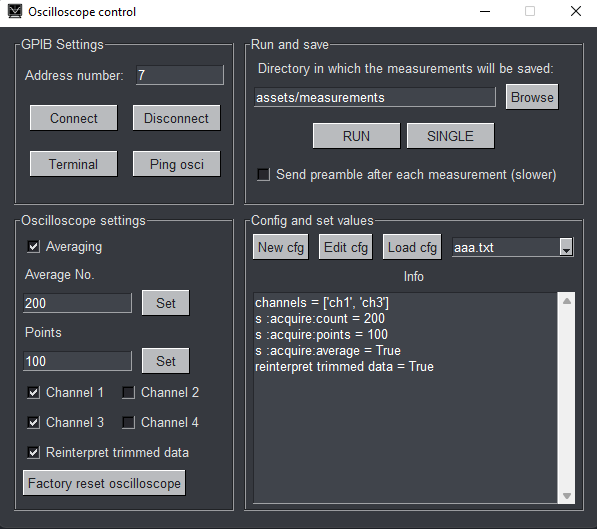
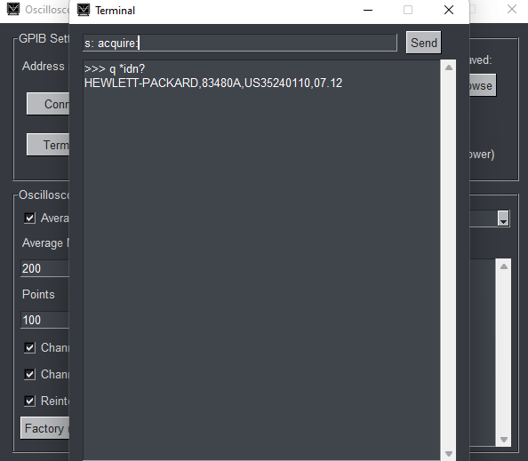
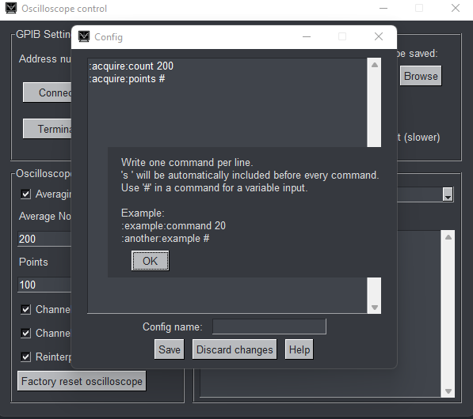
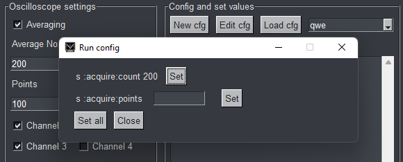

# HP83480A oscilloscope GUI application

## Requirements
1. Install Python modules: `pip install -r requirements.txt`

2. [hpctrl](https://github.com/TIS2020-FMFI/hpctrl): put `connect.ini` in the [root folder](https://github.com/TIS2021-FMFI/osciloskop) and `hpctrl.exe`, `winvfx.16.dll`, `gpiblib.dll` in [tools/hpctrl](tools/hpctrl)

3. Application won't launch without `.env` in the [root folder](https://github.com/TIS2021-FMFI/osciloskop).

## Binary compilation
Install PyInstaller: `pip install pyinstaller`

Compile:
`
pyinstaller --noconfirm --onefile --noconsole --windowed --hidden-import "pysimplegui" --hidden-import "python-dotenv" --icon "assets\icon\icon.ico" --name "OscilloscopeCtrl" "src\main.py"
`

## Launching
Application must be launched from the root folder, so `python src/main.py` or launch the binary in the root folder

## Screenshots
Main window  

Terminal  

Creating config  

Loading config  
